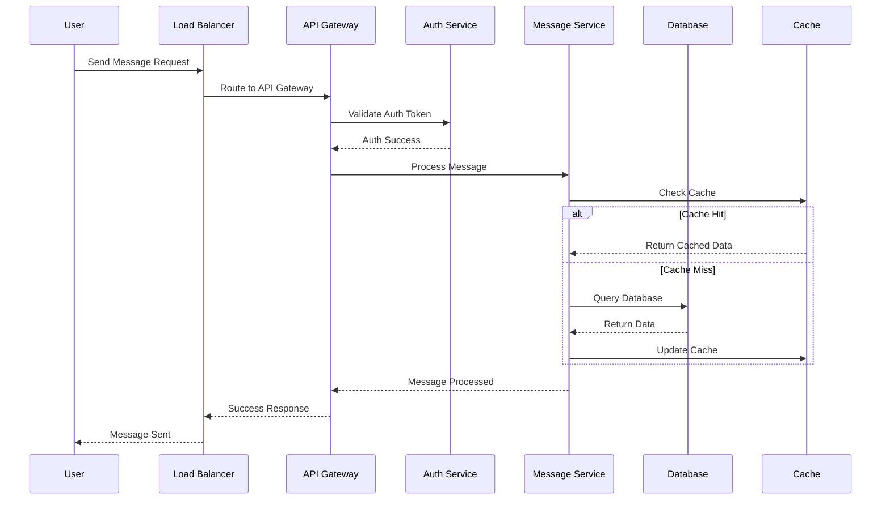

# 🚀 AI Maker Space - The Ultimate System Design Interview Simulator

> **"Turn your PDFs into a personal system design sensei"** 🥋

Welcome to the most epic system design interview experience you've ever seen! This isn't just another chat app - it's your personal AI interviewer that's been trained on YOUR system design knowledge base. Think of it as having a senior architect in your pocket, but cooler. 😎

## 🎪 What's This Magic?

This application is like having a **system design interview with a genius AI** that:
- 📚 **Reads your PDFs** and becomes an expert on YOUR reference materials
- 🎯 **Conducts structured interviews** with contextual, intelligent questions
- 🎨 **Generates production-ready Mermaid diagrams** (copy-paste ready for mermaid.live!)
- 📋 **Creates comprehensive system designs** that would make Netflix engineers jealous
- 🧠 **Gets smarter** the more PDFs you feed it

## 🎭 The Three Modes of Awesome

### 1. 🎯 System Design Interview (The Star of the Show)
Drop your system design PDFs in the `system_design_pdfs/` folder, tell the AI what system you want to design, and watch as it conducts a **5-question technical interview** that would make FAANG companies proud. You'll get:
- Contextual questions based on YOUR knowledge base
- A production-ready Mermaid sequence diagram
- A comprehensive system design document
- The confidence to ace any real interview

### 2. 📄 PDF RAG Chat (The Knowledge Whisperer)
Upload any PDF and have a conversation with it. The AI will answer questions using ONLY the content from your document. It's like having a conversation with your textbook, but the textbook actually responds!

### 3. 💬 General Chat (The Classic)
Sometimes you just want to chat with GPT. We got you covered with streaming responses and all the good stuff.

## 🚀 Quick Start (Get Running in 3 Minutes)

### Prerequisites
- Python 3.13+ (because we're living in the future)
- Node.js & npm (for that sweet React frontend)
- OpenAI API key (your ticket to AI paradise)
- `uv` package manager (because pip is so 2023)

### 🎬 The Setup Show

1. **Clone this beauty:**
```bash
git clone <your-repo-url>
cd ai-maker-space
```

2. **Switch to the interview branch:**
```bash
git checkout feature/system-design-interview
```

3. **Add your system design PDFs:**
```bash
# Drop your PDFs in here - the app will auto-index them on startup
ls system_design_pdfs/
# system-design-primer.pdf  <- Your PDFs go here!
```

4. **Set up the Python backend:**
```bash
# Create virtual environment with uv (fancy!)
uv venv
source .venv/bin/activate.fish  # or .venv/bin/activate for bash peasants 😉

# Install everything
uv pip install -e .
cd api
uv pip install -r requirements.txt
```

5. **Start the backend (Terminal 1):**
```bash
cd api
python app.py
```
🎉 **Backend running on:** http://localhost:8000

6. **Start the frontend (Terminal 2):**
```bash
cd frontend
npm install
npm start
```
🎉 **Frontend running on:** http://localhost:3000

## 🎪 How to Conduct Your First Interview

1. **Open** http://localhost:3000 in your browser
2. **Enter your OpenAI API key** (keep it secret, keep it safe! 🧙‍♂️)
3. **Make sure "System Design Interview" mode is selected** (it's the default because it's awesome)
4. **Enter what you want to design** (e.g., "Design a chat application like WhatsApp")
5. **Click "🎯 Start System Design Interview"**
6. **Answer 5 thoughtful questions** while the AI uses your PDF knowledge
7. **Get mind-blowing results:**
   - A Mermaid diagram ready for mermaid.live
   - A production-ready system design document
   - The satisfaction of a job well done

## 🎨 Sample Mermaid Output (Ready for mermaid.live!)



**Just copy this bad boy and paste it into mermaid.live - boom! 💥**

## 🏗️ Architecture (For the Curious Minds)

```
┌─────────────┐    ┌──────────────┐    ┌─────────────┐    ┌──────────────┐
│   React     │───▶│   FastAPI    │───▶│ aimakerspace│───▶│  OpenAI API  │
│  Frontend   │    │   Backend    │    │   Library   │    │              │
└─────────────┘    └──────────────┘    └─────────────┘    └──────────────┘
                           │                    │
                           ▼                    ▼
                   ┌──────────────┐    ┌─────────────┐
                   │ Interview    │    │ Vector DB   │
                   │ Sessions     │    │ (In-Memory) │
                   └──────────────┘    └─────────────┘
                                              ▲
                                              │
                                    ┌─────────────────┐
                                    │ Your PDF Files  │
                                    │ (Auto-indexed)  │
                                    └─────────────────┘
```

## 🎯 Pro Tips for Maximum Awesomeness

### 📚 PDF Knowledge Base Tips
- Add **system design primers** (like the famous GitHub one)
- Include **architecture pattern guides**
- Drop in **company engineering blogs** (Netflix, Uber, etc.)
- Add **database design references**
- Include **scalability best practices**

### 🎪 Interview Tips
- Be **specific** with your system requirements
- **Think out loud** - the AI learns from your reasoning
- Don't be afraid to **ask clarifying questions**
- The AI will **build on your previous answers** - it's paying attention!

## 🔧 Troubleshooting (When Things Go Sideways)

### Port 8000 Already in Use?
```bash
# Kill whatever's hogging your port
lsof -ti:8000 | xargs kill -9
# Then restart the backend
cd api && python app.py
```

### PDFs Not Loading?
- Check that PDFs are in `system_design_pdfs/` folder
- Restart the backend to re-index
- Check the terminal for indexing logs

### Frontend Won't Start?
```bash
# The classic IT solution
cd frontend
rm -rf node_modules
npm install
npm start
```

## 🎉 What Makes This Special?

- **🧠 Smart Context:** Uses YOUR PDFs to generate questions
- **🎯 Structured Flow:** 5-question format covering all system design aspects
- **📋 Production Ready:** Outputs you can actually use in real projects
- **🎨 Copy-Paste Friendly:** Mermaid diagrams ready for mermaid.live
- **🚀 Modern Stack:** FastAPI + React + OpenAI + aimakerspace
- **💫 Beautiful UI:** Because ugly interfaces are a crime against humanity

## 🤝 Contributing

Found a bug? Want to add a feature? Have a cool idea? 

1. Fork it 🍴
2. Create a feature branch 🌿
3. Make it awesome ✨
4. Submit a PR 🚀

## 📜 License

MIT License - because sharing is caring! 💖

---

**Ready to become a system design wizard?** 🧙‍♂️

Drop your PDFs in the folder, fire up the servers, and let the AI interview magic begin! 

*P.S. - Don't forget to star this repo if it helps you ace your next system design interview! ⭐*